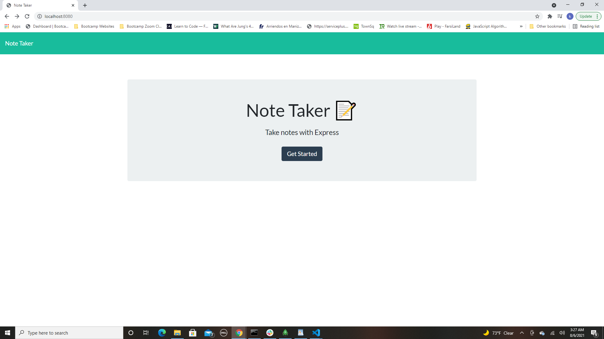
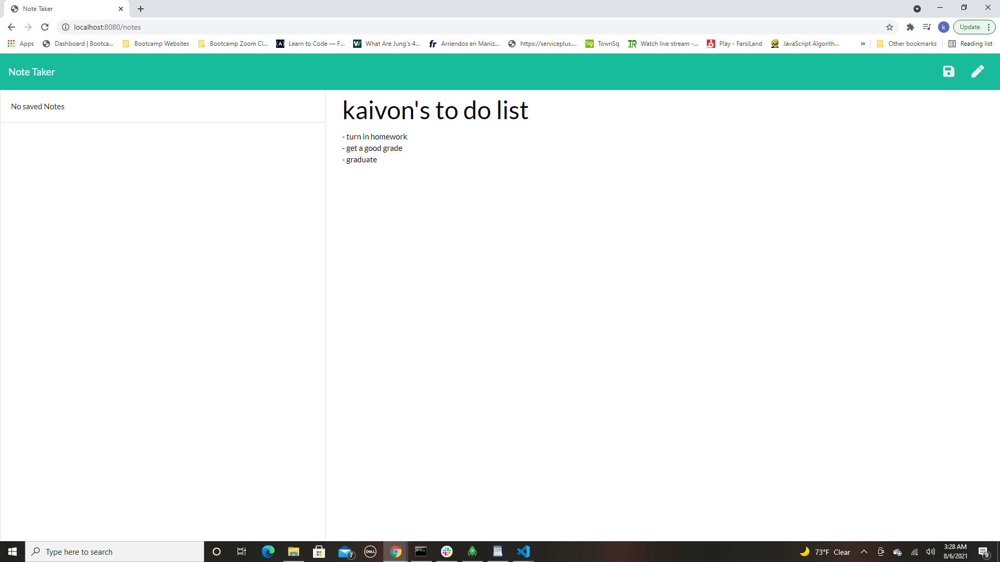
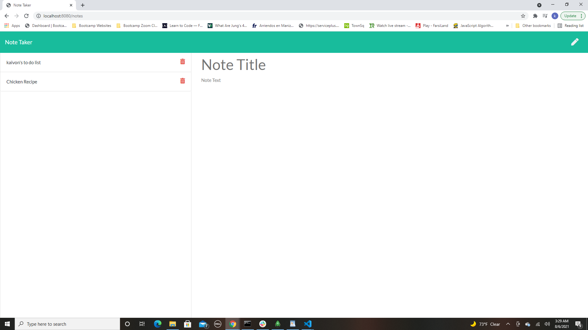
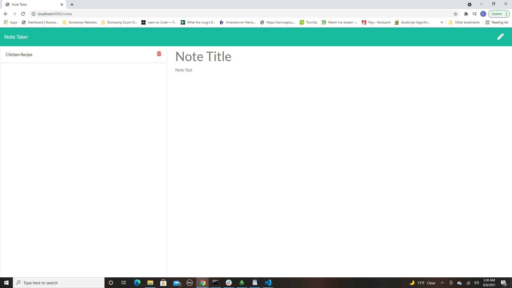
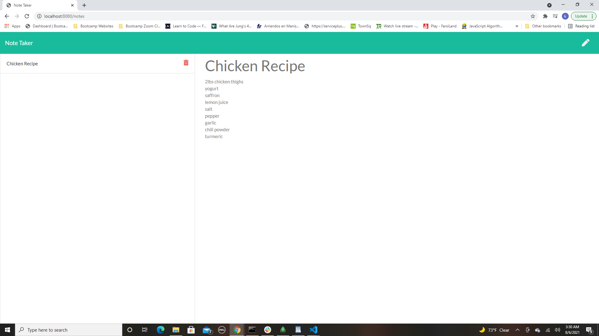

# Note-Taker

Visit the Deployed Site offered by Heroku:  

https://protected-cliffs-76829.herokuapp.com/

# Description

This is a simple note taker/to-do-list. You have add notes or lists, save them and delete them when finished. 

# How To Use

User can visit the website using the url above and just start creating lists or notes that they want to save or write down so they don't forget! 

# Technology Used

- Javascript
- Node.js
- Express
- Heroku

# Screenshots of pages working

# Contact 

Any questions or concerns about this app, please contact me:

Github: https://github.com/kaivont85
Email: kaivont@gmail.com